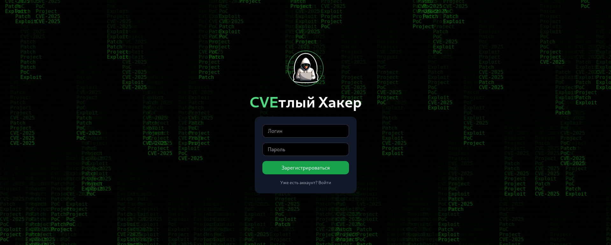
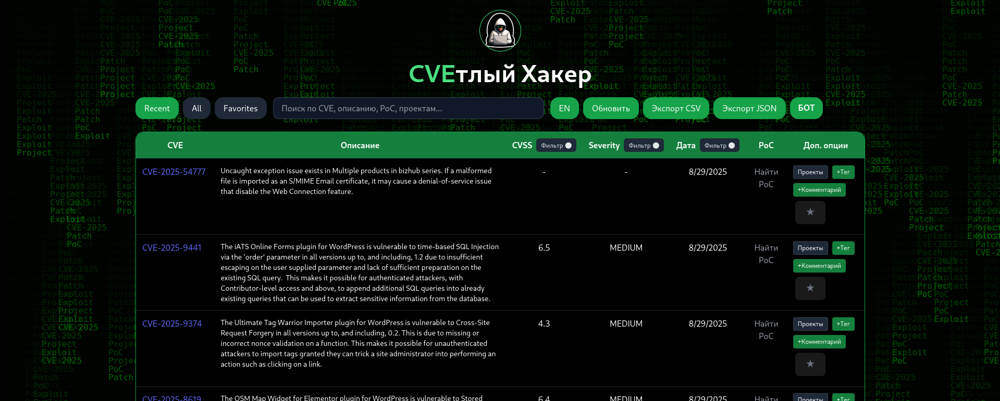
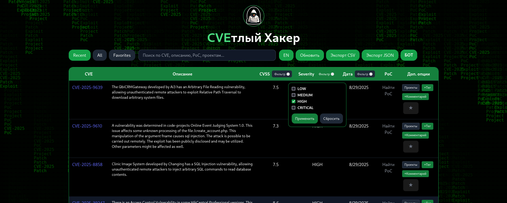
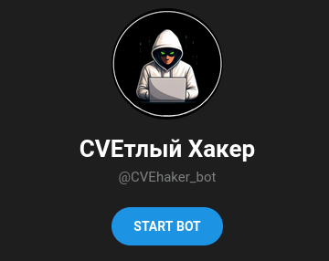
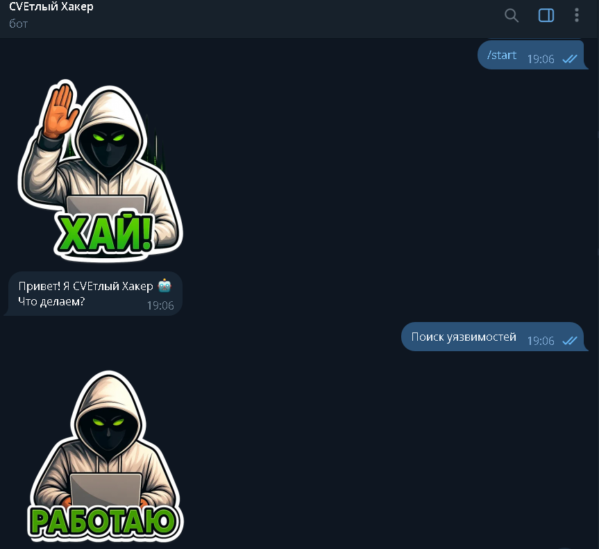
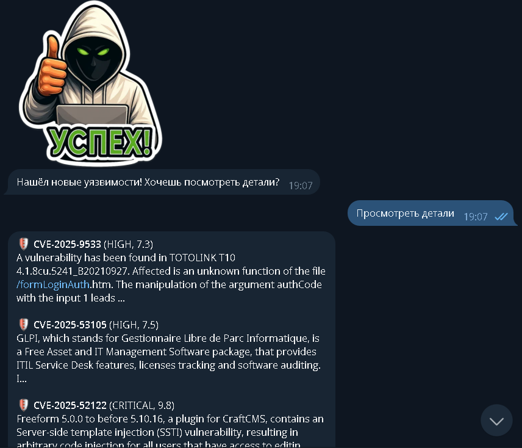
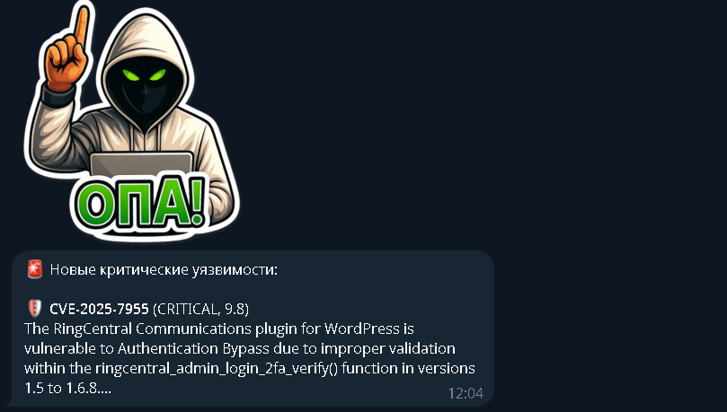

# FindCVE  

**FindCVE** — это система для поиска и мониторинга CVE, с интеграцией GitHub PoC и телеграм-ботом.  

---

## Структура проекта
FindCVE/
│── docker-compose.yml # запуск всех сервисов
│── README.md # документация
│── .gitignore
│── logs/ # все логи сервисов
│ └── .gitkeep
│── migrations/
│ └── init.sql # схема базы данных
│── services/
│ ├── cve-api/ # FastAPI сервер (backend API)
│ │ └── main.py
│ ├── cve-worker/ # фоновый загрузчик CVE из NVD
│ │ └── app.py
│ ├── web-ui/ # React фронтенд
│ │ └── src/App.jsx
│ └── cve-bot/ # Telegram-бот
│ └── bot.py
└── .env.example # шаблон для переменных окружения

---

## Полный стек

- **PostgreSQL** — хранилище CVE  
- **FastAPI** — API для фронтенда  
- **React + Tailwind** — Web UI  
- **Worker** — фоновая загрузка CVE из NVD  
- **Telegram Bot** — уведомления в телеграм  

---

## Запуск

bash:
git clone https://github.com/Mr-Perkins-creator/FindCVE.git
cd FindCVE

# Cоздаём свой .env на основе примера
cp .env.example .env

# Поднимаем сервисы
docker compose up --build

После сборки и запуска:
API доступно на - http://localhost:8080
Веб-интерфейс - http://localhost:3000
База данных - порт 5432
Логи сохраняются в logs/

## Скриншоты интерфейса
## Интерфейс для входа

## Интерфейс таблицы

## Фильтрация

## БОТ

## Работа Бота1

## Работа Бота2

## Уведомление от Бота о новых уязвимостях

Файл .env.example содержит все необходимые переменные.
Скопируйте его в .env и заполните своими значениями.
